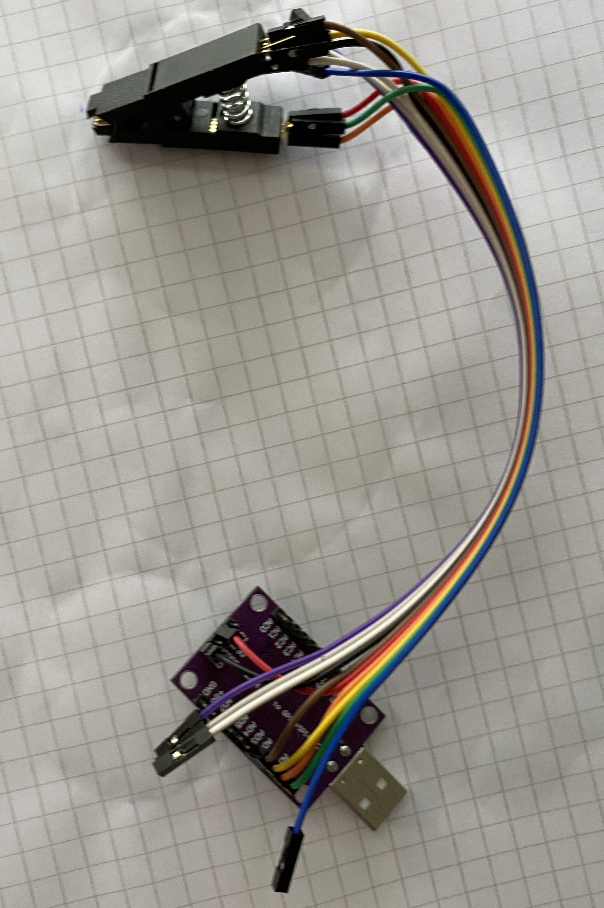

# T420-coreboot

I have followed these guides except that i have used at FT232H instead of an raspberrypi for readding and writing the bios to chipset [MX25L6406E](https://www.macronix.com/Lists/Datasheet/Attachments/8630/MX25L6406E,%203V,%2064Mb,%20v1.9.pdf)  

* [Lenovo T420 Coreboot W/Raspberry Pi](https://www.instructables.com/Lenovo-T420-Coreboot-WRaspberry-Pi)
* [t420-coreboot-guide](https://github.com/nenadstoisavljevic/t420-coreboot-guide?tab=readme-ov-file)


### FT232H 



#### Pinnout 

[FTDI_FT2232H](https://wiki.flashrom.org/FT2232SPI_Programmer#FTDI_FT2232H_Mini-Module)

| Name | Color | Test clip pin# | FT232H pin#|
| ---- | ----- | -------------- | ---------- | 
| /CS  | Brown | 1              | AD3        | 
| MISO | Yellow| 2              | AD1        | 
| GND  | Black | 4              | +3.3V      | 
| MOSI | Orange| 5              | AD1        | 
| SCLK | Green | 6              | AD0        | 
| VCC  | Red   | 8              | GND        | 


#### Read out the BIOS
```sh
flashrom -p ft2232_spi:type=232H -c MX25L6406E/MX25L6408E -r factory1.rom
```

#### Write back the compiled BIOS
```sh
flashrom -p ft2232_spi:type=232H -c MX25L6406E/MX25L6408E -w coreboot.rom
```

## LIBREBOOT 

I looked on this guide below for inspiration, one can't follow it exacly any more ate libreboot project have refactored especialluy the vendor files since this was made. I have used a debian bookworm container on top of a proxmox 
-> 8 mb or ram, and 15 gb drive, 8 gb is to small 

* [Installing libreboot on a ThinkPad T420](http://www.härdin.se/blog/2023/03/22/installing-libreboot-on-a-thinkpad-t420/)

### Download and build the developmet envirement  
```sh
git clone https://codeberg.org/libreboot/lbmk
```

## Update flash after it have been flashed first time
* [How do I "edit grub to add iomem=relaxed"?](https://askubuntu.com/questions/1120578/how-do-i-edit-grub-to-add-iomem-relaxed)

```sh
sudo flashrom -p internal:boardmismatch=force -c MX25L6406E/MX25L6408E -w coreboot.rom
```

## Tested hardware 
* Updated CPU to Intel i7-3632QM and with core boot one can go to ivy bridge
* AX210 Mini Pcie wlan 6E card  
* BE200  Mini Pcie wlan 7  card
* ATA Sandisk U100 in the Mini Pcie slot next to ram in the bottom  

